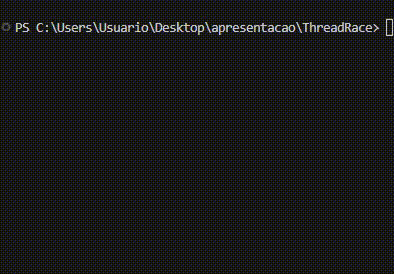
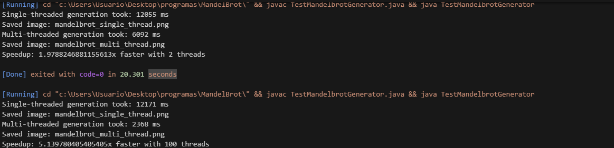

# Programação Concorrente e Orientada a Objetos
**Aluno:** Ricardo Facco Pigatto<br>
**Disciplina:** Paradigmas de Programação

## Apresentação de Exercícios 13/11
Antes da realização dos exercícios, pesquisei mais sobre programação concorrente.
Programas concorrentes são aqueles que podem executar várias tarefas de duas formas:<br>
Com **Paralelismo:** Quando duas tarefas são executadas ao mesmo tempo, desde que não tenham dependências de dados.<br>
Com **Concorrência:** Quando duas tarefas são executadas no mesmo intervalo de tempo, alternando entre elas.<br>

Em programas concorretes, é muito comum que as mesmas entradas gerem saídas diferentes, devido à forma como o sistema operacional alterna as tarefas. Esse comportamento é chamado de **não-determinismo**.<br>
Por exemplo, em um programa **determinístico**: 
```java
int a = 2 + 3;
System.out.println(a); // Sempre imprime 5
```
<br> Já em um programa concorrente **não-determinístico**, a ordem de execução pode mudar e gerar resultados diferentes a cada vez que o programa é executado.<br>
Exemplos desse tipo de programa podem ser vistos na prática abaixo.

## - Exercício ThreadRace
Nesse exercício, era pedido para analisar o código ThreadRace, que foi disponibilizado no material de aula e que está também presente nesse repositório.<br>
O código é bem simples, de primeira vista não me pareceu difícil de entender o que ele faz. Depois percebi o seguinte: uma das classes usa "extends Thread" enquanto a outra "implements Runnable", que são as duas
maneiras de criar threads. Pesquisei um pouco quais eram as diferenças e ví algo interessante, em uma das fontes que encontrei:<br>

*"Quando estendemos a classe Thread, na verdade não estamos sobrescrevendo nenhum dos seus próprios métodos.  
Em vez disso, estamos sobrescrevendo o método definido pela interface Runnable (que a classe Thread implementa)."*

Entrei na classe Runnable e ví que é uma interface com só um método dentro dela: run(). Dentro de Thread, de fato era feito "implements Runnable" com um método run() sobreescrevendo.<br>
Ou seja, voltando para o exercício, a classe Rabbit essencialmente **É** uma Thread já que é uma subclasse de Thread, e Turtle é uma classe que implementa uma interface.
Com isso concluído, dei run no código algumas vezes.<br>


<br>
Na primeira run, Rabbit ganhou.<br>
Na segunda run, Turtle ganhou.<br>
Na terceira run, Rabbit ganhou, sendo que Turtle ainda estava na posição 6.<br>

As saídas podem variar, e por isso esse programa é chamado **não-determinístico**

## - Exercício AnotherThreadRace
Para esse exercício, precisei criar uma nova classe de animal e executar a corrida.
```java
class Fish implements Runnable {
	private String name;

	public Fish(String name) {
		this.name = name;
	}

	private void runLikeFish() {
		System.out.println(name + " is swimming fast");
	}

	public void run() {
		System.out.println(name + " fish is at the start of the race!");
		for (int pos = 10; pos > 0; pos--) {
			runLikeFish();
			System.out.println(name + " is at position " + pos);
		}
		System.out.println(name + " fish finished the race!");

	}
}
```
Essa classe é extremamente parecida com a classe Turtle, mas Fish "nada" em vez de "correr". A classe fish também implementa Runnable.<br>
Em main:
```java
Thread f = new Thread(new Fish("Nemo"));
f.start();
```
Main completa:
```java
class AnotherThreadRace {
	public static void main(String[] args) {
		Rabbit r = new Rabbit("Snowball"); // extends Thread
		Thread t = new Thread(new Turtle("Donatello")); // implements Runnable
		Thread f = new Thread(new Fish("Nemo")); // implements Runnable
		r.start();
		t.start();
		f.start();
	}
}
```
Ao rodar o programa, a saída foi alternando cada animal.<br>

Ou seja, o método que faz a "alternância" acontecer (novas threads serem criadas) é start()?<br>
Sim, pois quando troquei "start()" por "run()" em cada objeto, a saída foi a execução de cada metódo run de cada animal, em ordem sequencial.

## - Exercício BetterThreadRace
Nesse exercício, era necessário melhorar o código do arquivo AnotherThreadRace pois nele há redundâncias. Precisava criar uma super-classe
AnimalRunner, da qual seriam derivadas as 3 classes de animais.
Como um extra, pesquisar sobre lambda expressions e functional interfaces.<br>

Em Runnable, eu já tinha percebido que havia um @FunctionalInterface em cima, então pesquisei e descobri que as interfaces funcionais são aquelas
que possuem um único método abstrato. Ou seja, tal método pode ser implementado por uma expressão lambda.<br>

Antes de tentar usar lambda, fiz as alterações para conseguir usar a nova classe AnimalRunner:
```java
class AnimalRunner implements Runnable {
	private String name;

	public AnimalRunner (String name) {
		this.name = name;
	}

	private void runLikeName() {
		System.out.println(name + animalType() + " is going fast");
	}

	public String animalType() {
		return "animalType";
	}

	public void run() {
		System.out.println(name + animalType() + " is at the start of the race!");
		for (int pos = 10; pos > 0; pos--) {
			runLikeName();
			System.out.println(name + " is at position " + pos);
		}
		System.out.println(name + animalType() + " finished the race!");
	}
}
```
E as classes de animais: 
```java
class Rabbit extends AnimalRunner {
	public Rabbit (String name) {
		super(name);
	}

	@Override
	public String animalType() {
		return " rabbit";
	}
}
```
Dessa forma, o programa roda como o anterior.<br>
Sendo sincero, fiquei tentando usar expressões lambda mas não consegui achar algum lugar que se encaixe de forma muito útil, apesar de
que posso ter pensado pouco no problema.

## - Exercício MandelbrotGenerator
Nesse eu fiz vários testes, e um deles foi comparar o tempo que demora pra gerar a imagem, com zoom 8000<br>



Com 2 threads, foi quase 2x mais rápido que o single-thread. com 100 threads, foi 5x mais rápido. Quando testei colocando 1000 threads, foi 4.98x mais rápido. Ou seja, há um sweet spot para o número de threads, 
que depende do hardware utilizado.

# Referências
https://liascript.github.io/course/?https://raw.githubusercontent.com/AndreaInfUFSM/elc117-2025b/main/classes/28/README.md#22<br>
https://www.baeldung.com/java-runnable-vs-extending-thread<br>
https://pt.stackoverflow.com/questions/194959/implementar-runnable-ou-estender-thread<br>
https://www.quora.com/What-happens-when-a-thread-start-is-called-in-Java<br>
https://www.baeldung.com/java-8-functional-interfaces<br>
https://www.w3schools.com/java/java_lambda.asp<br>
https://docs.oracle.com/javase/tutorial/java/javaOO/lambdaexpressions.html
